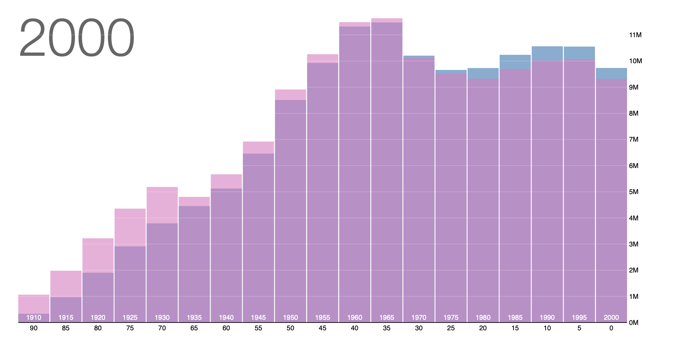

# Population Distribution

The visualization illustrates the age group distribution in the United States spanning 150 years. Utilize the arrow keys to examine the evolving population, with data sourced from the Minnesota Population Center. Navigate through different years using the arrow keys. The blue bars represent the male population within each five-year age group, while the pink bars indicate the female population. The bars' partial transparency allows for an understanding of their overlap, offering a more effective comparison of gender distribution than the conventional side-by-side presentation.
 
 
